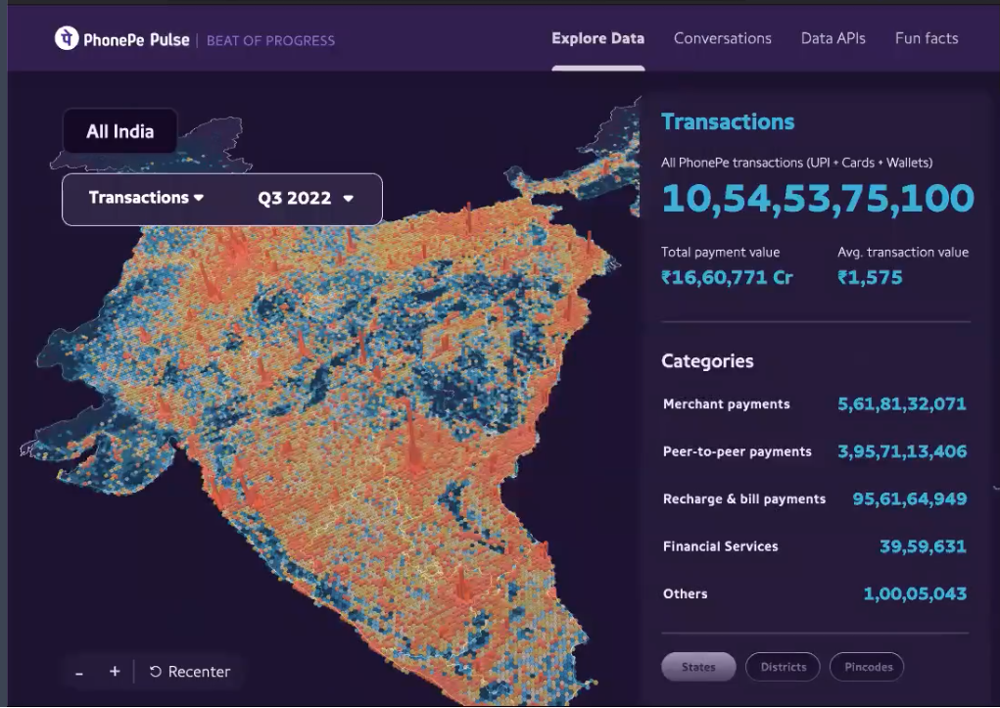

## Brewing Code With Siddharth
- Majority part is to understand how to solve a problem and how to solve in neat and clean way.
	- 50% of what, how, and why of problem. (Preparing Design Doc)
- How to scale applications?
	- Prime focus should be solving the problem in an efficient way.
	- UPI Transactions in India
	- 
- What is most important while scaling?
	- Design Patterns etc.
	- SLA, on calls?
- Different Tech Stacks for different Problems
- Security Knowledge
	- some basic knowledge
	- defensive Programming
- DSA for Backend Development
	- comes in handy but most important
- DSA interview
	- hacker earth
	- JSON parsing and load balancing
	- 2 hour project
	- System Design
	- Selenium Binary
	- Linux Commands
	- DSA - Easy + Medium Questions
	- Machine Coding
	- Pair Programming
- Frontend for project
	- depends on the project
	- video, blogs + screen recording
- Core
	- System Design
	- SQL, DBMS
	- OS
	- Internals of DBMS
	- Command on Ruby on Rails
- 5 years Experience - switch to different domain
	- You need to have certain level of skills
	- Internal Job Board
	- Learn skills, interact with different teams
- Scalability
	- Cloud
	- refactor services
- DevOps
	- No need to know lot of DevOps
	- Basic understanding is required
	- Not much for junior devs
- Spring Boot vs NodeJS
	- depends on Business UseCase
- Tips
	- Need to learn how to read code.
	- You must have good command over tools and language.
		- Very Important
	- You have to know the about the business problem.
	- Linux Commands + GIT
	- How SSH works
- Writing Testing is very important
	- How to write unit tests