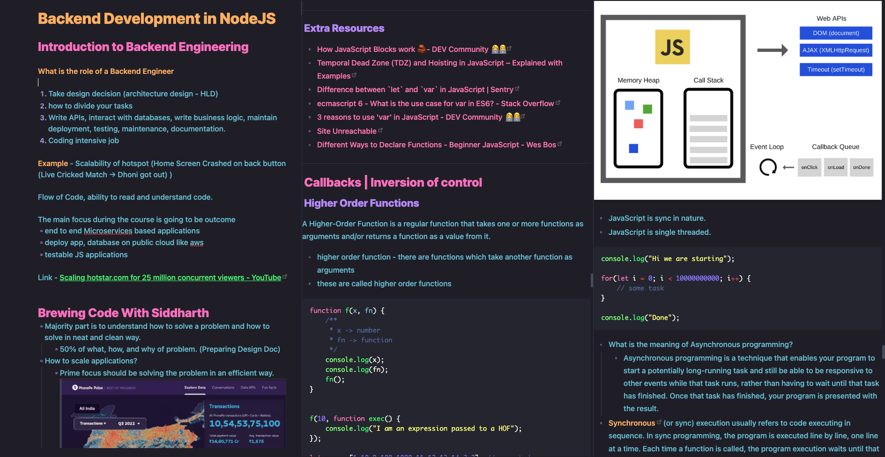

# 🌲 Backend Specialization

This repository is dedicated to the Backend Development with NodeJS. Here you will find key highlights/notes/code, reference material related to Backend Engineering, and much more. Join us on this journey to become a Backend developer with NodeJS.

`Cousre Instructor` - [Sanket Singh](https://in.linkedin.com/in/singhsanket143) SWE II @ Google | Ex-SDE @ Linked[In]

## 📝 How do I take notes before uploading them to GitHub?

I prefer taking notes in bullet format, with subpoints providing explanations and additional reference material to solidify my understanding of the topic. **+** I use [Obsidian](https://obsidian.md/) for everything (Notes, Journal, Knowledge Management etc)

## ✨ Notes Preview

## 🏆 Lectures

### 📚 Advance JavaScript - Part 1

- [Introduction to JS](https://github.com/xoraus/Backend-Specialization/blob/main/Lectures/Introduction-to-JS%202-Operators-Conditionals-Loops-basic.md)
- [Is Javascript Compiled? I Lexical Scoping](https://github.com/xoraus/Backend-Specialization/blob/main/Lectures/Is-Javascript-Compiled%3F-Lexical-Scoping.md)
- [Lexical Scoping I Auto Global](https://github.com/xoraus/Backend-Specialization/blob/main/Lectures/Lexical-Scoping-Auto-Global.md)
- [Function Expression](https://github.com/xoraus/Backend-Specialization/blob/main/Lectures/Function-Expression.md) 

### 📚 Advance JavaScript (Asynchronous JS) - Part 2
- ✅ [Callbacks Inversion of Control](https://github.com/xoraus/Backend-Specialization/blob/main/Lectures/Callbacks-IVC.md)
- ✅ [How runtime helps in async nature of JS](https://github.com/xoraus/Backend-Specialization/blob/main/Lectures/How-runtime-helps-in-async-nature-of-JS.md) 
- ✅ [Async Behaviour with Callbacks](https://github.com/xoraus/Backend-Specialization/blob/main/Lectures/Async-Behaviour-with-Callbacks.md) 
- ✅ [Introduction to Promises](https://github.com/xoraus/Backend-Specialization/blob/main/Lectures/intro-to-promises.md)
- 🚧 [Promises: Part 2]() 🚧 (work in progress)
- 🚧 [Promises: Part 3]()
- 🚧 [Promises: Part 4]()
- 🚧 [Generators and iterators]()
- 🚧 [Async Await]()

## Databases & SQL

- ✅ [Introduction to Databases & DBMS](https://github.com/xoraus/Backend-Specialization/blob/main/Lectures/intro-to-dbms.md) 
- ✅ [SQL: Introduction](https://github.com/xoraus/Backend-Specialization/blob/main/Lectures/SQL1.md) 🔥updated on [17-Mar-2023]
- ✅ [SQL: Commands](https://github.com/xoraus/Backend-Specialization/blob/main/Lectures/SQL2.md) 🔥updated on [17-Mar-2023]
- ✅ [SQL: Joins](https://github.com/xoraus/Backend-Specialization/blob/main/Lectures/SQL3.md) 🔥updated on [17-Mar-2023]
- [SQL: Normalization](#) >>>> coming soon 

## 👨🏻‍💻 Industry Professionals
- [Brewing Code With Siddharth](https://github.com/xoraus/Backend-Specialization/blob/main/Industry-Professionals/Brewing-Code-With-Siddharth.md)

## 🧵 Resources/Articles by fellow batchmates

By [Milind's Blog](https://blog.milind.live/) 

- [Wait, so you're saying JavaScript isn't weird!](https://blog.milind.live/wait-so-youre-saying-javascript-isnt-weird)
- [Understanding why the famous [object Object] pops up and handling it, tactfully.](https://blog.milind.live/object-object)
- [Abstract Equality and Special Types!](https://blog.milind.live/abstract-equality-and-special-types)

By [Mohini Mahato](https://www.linkedin.com/in/mohinimahato/)

- [Abstract Operation](https://www.linkedin.com/posts/mohinimahato_toprimitive-abstract-operator-activity-7021741753808433153-Xa6J)

By [Sachin](https://github.com/Sachin-RJ7) -> 'Handwritten'

- [Advance JavaScript](https://github.com/xoraus/Backend-Specialization/blob/main/Notes/Advance-JS.pdf)
- [Callbacks, Inversion of Control](https://github.com/xoraus/Backend-Specialization/blob/main/Notes/callbacks_Inversion_of_control_.pdf)
- [How Runtime helps in async nature of JS](https://github.com/xoraus/Backend-Specialization/blob/main/Notes/How_runtime_helps_in_async_nature_of_JS.pdf)

## 📚 Notes from the Orientation Session🔥

**What is Backend Engineering?**

Backend engineering is a branch of software engineering that focuses on the server-side of web development. It involves the development and maintenance of the servers, databases, APIs, and other components that make up the back-end of web applications. 

**What is the role of a Backend Engineer**

1. Design decision making and creation of high-level design (HLD) for architecture
2. Writing APIs and interacting with databases
3. Implementing business logic
4. Maintaining deployment processes and conducting testing
5. Performing maintenance and documenting work
6. Collaborating with front-end engineers, database administrators, and other stakeholders
7. Writing clean and efficient code
8. Building robust and scalable systems to support business needs
9. Ensuring seamless integration with front-end systems
10. Providing a seamless user experience.

**Example** - Scalability of hotspot (Home Screen Crashed on back button (Live Cricked Match → Dhoni got out) )

Flow of Code, ability to read and understand code.

The main focus during the course is going to be outcome
- end to end Microservices based applications
- deploy app, database on public cloud like aws
- testable JS applications

Link - [Scaling hotstar.com for 25 million concurrent viewers - YouTube](https://www.youtube.com/watch?v=QjvyiyH4rr0)

---

## 🎓 Course Curriculum Key Highlights

- Basics of JavaScript 
- Advanced JavaScript 
- Scopes in JS 
- Closures in JS 
- Asynchronous JavaScript with Callbacks and Promises 🕰️
- Hoisting and Coercion 
- Node JS 
- Express JS 🔥
- Understanding how the internet works 🕸️
- CI/CD 
- Micro-service based project development 
- Message brokers and Queues 💬
- Introduction to programming and problem solving with JavaScript (Recorded) 🔍
- Design Documentation and Feature Planning 📝
- HLD discussion for the projects 💬
- Deployments on Elastic Beanstalk or EC2 🚀
- REST 
- gRPC 🔥
- API development 
- CRUD API 
- HTTP / HTTPS 🌐
- Web Sockets 💬
- Deployment on AWS and Heroku 🚀
- Containers, Docker, and Intro to Kubernetes 🐳
- MongoDB 💾
- MySQL 💾
- ORM and ODM 
- Airline Ticket Booking System Project 🛫
- Blog Project 📝
- Chat Application Project 💬
- Twitter Application Project 🐦
- Networking 🌐
- DOM Manipulation (extra frontend topic, will be taken in extra class or recorded session) 💻
- Streams in NodeJS 🕰️

## 🚨 Pull requests are Welcome 😊, The more the better.
