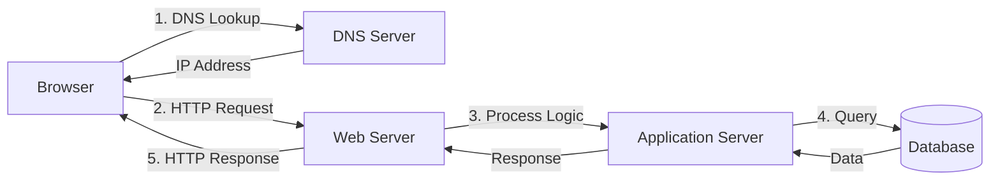
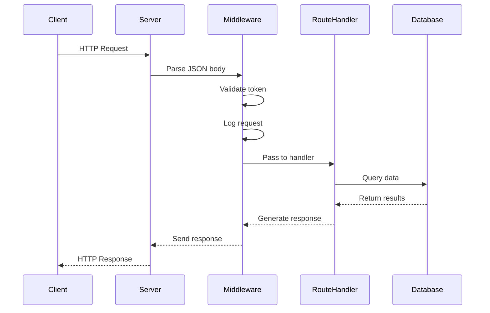
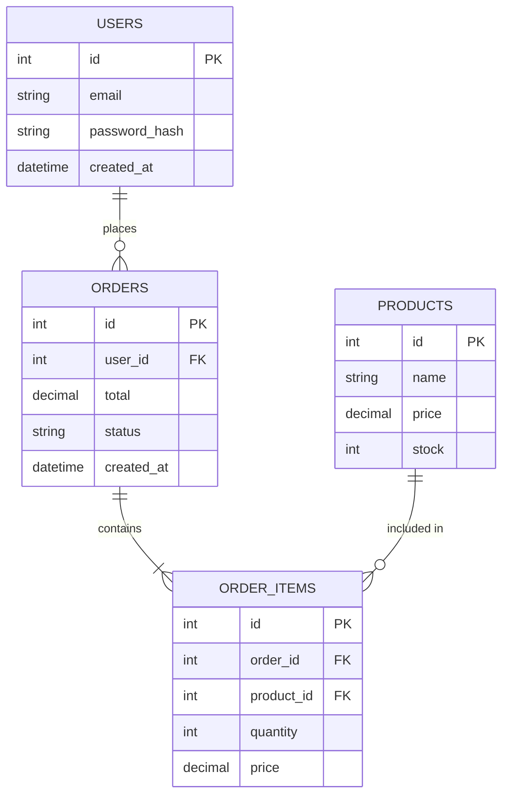
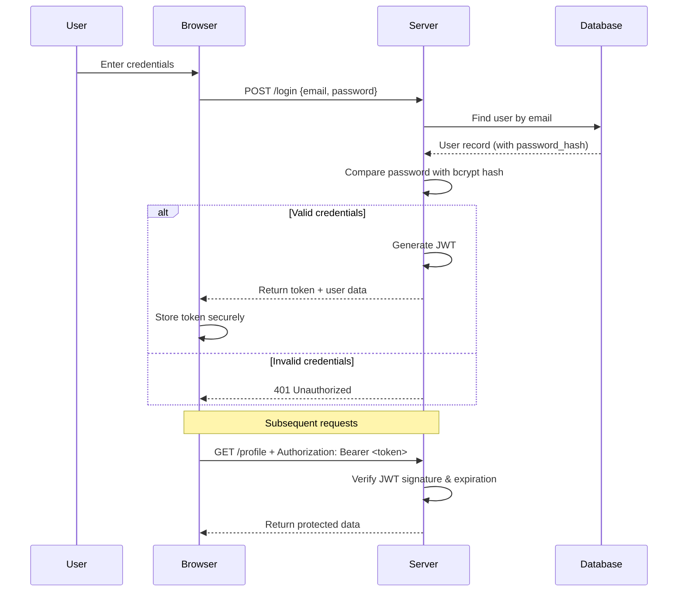
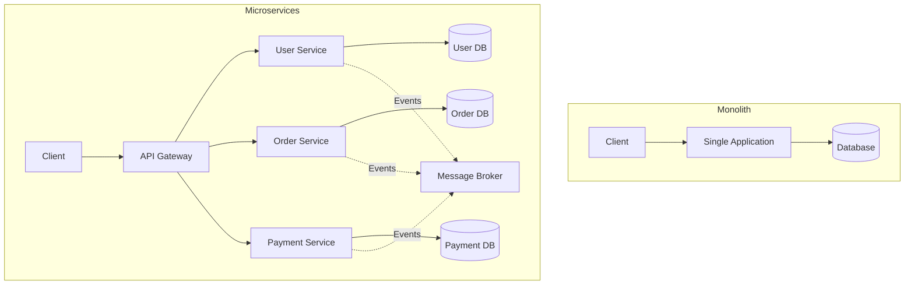
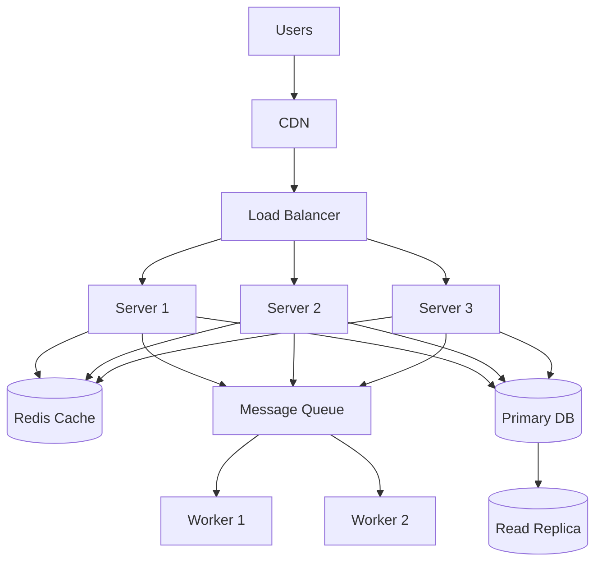
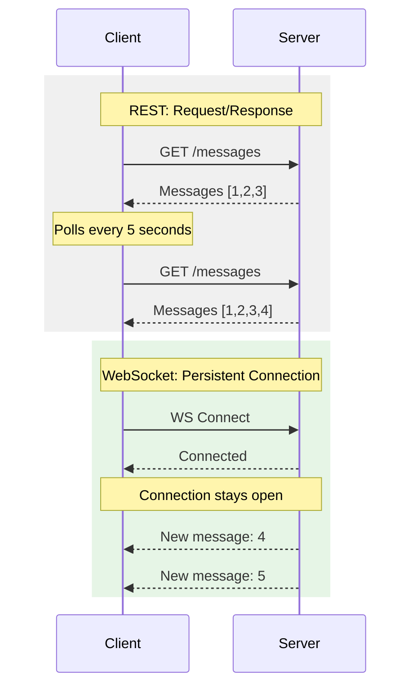

<div align="center">

# 🚀 BackendBytes ZeroToOne

**The definitive beginner-friendly roadmap to backend engineering.**

[](https://github.com/xoraus/BackendBytes-ZeroToOne/stargazers)
[](LICENSE)
[](https://github.com/xoraus/BackendBytes-ZeroToOne/graphs/contributors)
[](https://github.com/xoraus/BackendBytes-ZeroToOne/commits/main)

*From zero backend knowledge → building production-ready systems.*

[🚀 Start Learning](#-quick-start) • [📋 Roadmap](#-backend-roadmap-levels) • [📁 Repository](#-repository-navigation) • [❓ FAQ](#-faq)

</div>

---

## 📖 Table of Contents

- [What is Backend Development?](#-what-is-backend-development)
- [Why This Repository?](#-why-this-repository)
- [Learning Philosophy](#-learning-philosophy)
- [Backend Roadmap (Levels)](#-backend-roadmap-levels)
  - [Level 0 — Internet Fundamentals](#level-0--internet-fundamentals)
  - [Level 1 — Programming Foundations](#level-1--programming-foundations)
  - [Level 2 — Backend Fundamentals](#level-2--backend-fundamentals)
  - [Level 3 — Databases](#level-3--databases)
  - [Level 4 — Authentication & Security](#level-4--authentication--security)
  - [Level 5 — Architecture](#level-5--architecture)
  - [Level 6 — Scaling](#level-6--scaling)
  - [Level 7 — DevOps Basics](#level-7--devops-basics)
  - [Level 8 — Advanced Topics](#level-8--advanced-topics)
- [Repository Navigation](#-repository-navigation)
- [Learning Paths / Study Plans](#-learning-paths--study-plans)
- [Practical Project Progression](#-practical-project-progression)
- [Backend Tooling](#-backend-tooling)
- [Resource Recommendations](#-resource-recommendations)
- [Common Beginner Mistakes](#-common-beginner-mistakes)
- [Contributing](#-contributing)
- [FAQ](#-faq)

---

## 🤔 What is Backend Development?

> **Backend development is everything you don't see—but absolutely depend on.**

When you open Instagram and your feed instantly loads, when you send money via UPI, when you log into your email—none of that magic happens on your phone screen. It happens on **servers** in data centers around the world, running code written by backend engineers.

### The Simple Analogy

Imagine a restaurant:

| What You See (Frontend) | What You Don't See (Backend) |
|------------------------|------------------------------|
| Beautiful dining area, menu, decor | Kitchen, inventory, suppliers, payroll |
| Waiter takes your order | Chef prepares your food |
| You pay at the counter | Payment processing, fraud detection, receipts |
| You rate the restaurant on an app | Data storage, analytics, recommendations |

**Backend engineering is the kitchen, the supply chain, the accounting, and the management**—everything that makes the restaurant actually work.

### What Problems Does Backend Solve?

- **🔐 Authentication**: Who are you? (login, signup, password reset)
- **💳 Payments**: Securely moving money between accounts
- **🗄️ Databases**: Storing billions of user posts, messages, and profiles reliably
- **🌐 APIs**: Letting your phone app talk to servers in a structured way
- **📁 File Uploads**: Handling profile pictures, videos, and documents
- **🔔 Notifications**: Sending you a push notification when someone messages you
- **⚡ Caching**: Making popular content load in milliseconds instead of seconds
- **📨 Queues**: Processing 1 million emails without crashing the server
- **🚀 Deployment**: Getting code from a laptop to millions of users

### Real-World Example: Ordering Food Online

```
You open the app → Frontend
  ↓
App shows restaurants near you → Backend fetches from database using your GPS
  ↓
You add items to cart → Backend validates prices, checks availability
  ↓
You pay → Backend talks to payment gateway, verifies transaction
  ↓
Restaurant gets order → Backend sends notification via queue
  ↓
You track delivery → Backend sends real-time GPS updates via WebSocket
  ↓
Order completes → Backend updates database, sends receipt email
```

Every single arrow involves backend engineering.

### Frontend vs Backend

| Aspect | Frontend | Backend |
|--------|----------|---------|
| **Where it runs** | Browser / Mobile app | Server / Cloud |
| **What users see** | Buttons, colors, animations | Data, logic, security |
| **Main languages** | HTML, CSS, JavaScript | JavaScript (Node.js), Python, Java, Go |
| **Focus** | User experience, design | Performance, reliability, security |
| **Analogy** | Car dashboard | Car engine, transmission, fuel system |

**Neither works without the other.** But backend is where the "business" actually happens.

---

## 🎯 Why This Repository?

The internet is flooded with backend tutorials that:
- Assume you already know what an API is
- Skip the "why" and jump to code
- Teach frameworks before fundamentals
- Leave you with tutorial projects that break in production

**BackendBytes-ZeroToOne is different.**

This repository is designed as a **mentor-guided learning path** that takes you from absolute zero to building production-grade backend systems. Every concept is explained as if you're hearing it for the first time—because you might be.

### Who Is This For?

- ✅ **Complete beginners** who've never written a server
- ✅ **Self-taught learners** tired of scattered, contradictory resources
- ✅ **Frontend developers** ready to understand what happens behind the API
- ✅ **CS students** who want practical, job-ready backend skills
- ✅ **Bootcamp graduates** who need to fill gaps in their backend knowledge
- ✅ **Anyone overwhelmed** by the sheer volume of backend technologies

### What You'll Build

By the end of this journey, you'll have built:
- A secure authentication API
- A full e-commerce backend
- A real-time chat system
- A microservices-based airline booking engine
- Production deployments on cloud infrastructure

---

## 🧠 Learning Philosophy

> **"You don't learn backend by reading about it. You learn it by building, breaking, and fixing."**

### How to Use This Repository

#### 1. Sequential Learning
Backend concepts build on each other like a skyscraper. You can't understand JWT authentication (Level 4) without understanding HTTP and APIs (Level 2). Follow the roadmap in order. Skipping levels leads to fragile understanding.

#### 2. Project-Based Learning
Every concept in this repository connects to a real project. When you learn about databases, you'll build a TODO API. When you learn about authentication, you'll secure it. Theory without practice is entertainment, not education.

#### 3. Concept → Implementation → Architecture
For every topic, we follow a three-step cycle:
- **Concept**: What is this and why does it exist?
- **Implementation**: How do I write the code?
- **Architecture**: How does this fit into a production system?

#### 4. Build While Learning
Don't wait until you "finish" a level. Start coding on Day 1. Your first server will be messy—and that's perfect. You'll refactor it as you learn more.

#### 5. Repetition & Active Recall
- After each lecture, close the notes and explain the concept out loud
- Build the same project twice: once while learning, once from memory a week later
- Teach what you learned to someone else (or a rubber duck)

### The Mindset Shift

| Instead of... | Think... |
|--------------|----------|
| "I need to memorize this syntax" | "I need to understand why this pattern exists" |
| "This error is frustrating" | "This error is teaching me how the system works" |
| "I'll deploy when it's perfect" | "I'll deploy when it works, then improve it" |
| "I need to learn everything first" | "I'll learn what I need for the project I'm building" |

---

## 🗺️ Backend Roadmap (Levels)

> **"A journey of a thousand miles begins with a single step."** — But it helps to have a map.

Each level includes: **what it is**, **why it matters**, **beginner-friendly examples**, and **practical project ideas**.

---

### Level 0 — Internet Fundamentals

**⏱️ Time Estimate:** 1 week  
**🎯 Goal:** Understand how information moves across the internet before writing a single line of backend code.

#### What It Is

Before you build a house, you need to understand how electricity and plumbing work. Before you build backends, you need to understand how the internet works. This level covers the invisible infrastructure that makes every web application possible.

#### Why It Matters

Every bug you'll ever debug, every API you'll design, every performance issue you'll solve—traces back to these fundamentals. A backend engineer who doesn't understand HTTP is like a carpenter who doesn't understand wood grain.

#### Key Concepts

| Concept | Simple Explanation |
|---------|-------------------|
| **Client / Server** | Client asks (your phone/browser). Server answers (the computer running your backend). |
| **Request / Response Cycle** | Like ordering at a restaurant: you ask, kitchen prepares, waiter brings it back. |
| **DNS** | The internet's phonebook. Converts `google.com` → `142.250.185.78`. |
| **HTTP** | The language browsers and servers speak. Methods: GET (read), POST (create), PUT (update), DELETE (remove). |
| **HTTPS** | HTTP + encryption. Like sending a letter in a locked box instead of a transparent envelope. |
| **Ports** | Like apartment numbers in a building. IP address = building, port = specific apartment. |
| **Cookies** | Small notes a website leaves in your browser. "Remember me" = cookie. |
| **Sessions** | Server-side memory of who you are. "This user is logged in until 3 PM." |
| **JSON** | The universal data format. Looks like JavaScript objects: `{"name": "Alice", "age": 25}` |
| **APIs** | A menu for programmers. "Here are the operations our server supports." |

#### The Request Lifecycle


```mermaid
graph LR
    A[Browser] -->|1. DNS Lookup| B[DNS Server]
    B -->|IP Address| A
    A -->|2. HTTP Request| C[Web Server]
    C -->|3. Process Logic| D[Application Server]
    D -->|4. Query| E[(Database)]
    E -->|Data| D
    D -->|Response| C
    C -->|5. HTTP Response| A
```

#### Practical Project Ideas

- 🔧 **Ping Tool**: Build a script that checks if websites are reachable
- 🔧 **URL Expander**: Follow redirects to find the final destination of short links
- 🔧 **HTTP Inspector**: Use tools like Postman/Insomnia to inspect real API requests

#### ✅ Progress Checklist

- [ ] I can explain the difference between HTTP and HTTPS to a non-technical friend
- [ ] I understand what happens when I type `google.com` and press Enter
- [ ] I can read and write basic JSON
- [ ] I know the difference between GET and POST
- [ ] I understand what a port is and why port 80/443 matter

---

### Level 1 — Programming Foundations

**⏱️ Time Estimate:** 2–3 weeks  
**🎯 Goal:** Write clean, logical code that a server can execute reliably.

#### What It Is

Backend engineering is programming. Before you build servers, you need to think like a programmer: break problems into steps, handle errors gracefully, and write code that other humans can read.

This level uses **JavaScript** (via Node.js), the most accessible entry point for backend beginners with the largest ecosystem.

#### Why It Matters

Bad code in a browser crashes one tab. Bad code on a server can leak user data, lose payments, or take down entire platforms. The fundamentals you learn here are the foundation of reliable systems.

#### Key Concepts

| Concept | Why It Matters for Backend |
|---------|---------------------------|
| **Variables & Types** | Storing user IDs, prices, timestamps accurately |
| **Functions** | Reusable logic: `hashPassword()`, `validateEmail()` |
| **Conditionals & Loops** | Handling different user roles, processing lists of orders |
| **Arrays & Objects** | Representing collections: users, products, cart items |
| **Async / Await** | Servers handle thousands of requests simultaneously—async is non-negotiable |
| **Error Handling** | A crashed server means angry users. `try/catch` saves production systems |
| **Modules** | Organizing code into files: `auth.js`, `database.js`, `payments.js` |
| **Environment Variables** | Keeping secrets (API keys, passwords) out of your code |

#### Code Example: Async Error Handling

```javascript
// ❌ Bad: Unhandled promise rejection crashes the server
app.get('/user', async (req, res) => {
  const user = await db.findUser(req.params.id); // What if this fails?
  res.json(user);
});

// ✅ Good: Graceful error handling
app.get('/user', async (req, res, next) => {
  try {
    const user = await db.findUser(req.params.id);
    if (!user) {
      return res.status(404).json({ error: 'User not found' });
    }
    res.json(user);
  } catch (error) {
    next(error); // Pass to error handler
  }
});
```

#### Practical Project Ideas

- 🔧 **CLI Calculator**: A terminal calculator with history and error handling
- 🔧 **File Organizer**: Script that sorts downloads folder by file type
- 🔧 **Password Generator**: Generates secure passwords with configurable rules

#### ✅ Progress Checklist

- [ ] I can write functions that accept and return data
- [ ] I understand `async/await` and why callbacks evolved into promises
- [ ] I can handle errors without crashing my program
- [ ] I use `process.env` for configuration, never hardcoded secrets
- [ ] I can explain the difference between `null` and `undefined`

---

### Level 2 — Backend Fundamentals

**⏱️ Time Estimate:** 2–3 weeks  
**🎯 Goal:** Build your first server and understand how requests flow through an application.

#### What It Is

This is where backend engineering truly begins. You'll write code that listens for network requests, processes them, and sends back responses. You'll learn the patterns that power virtually every web application.

#### Why It Matters

Everything you build from this point forward is an extension of these concepts. Authentication is middleware. APIs are routes. Every request follows the lifecycle you'll learn here.

#### Key Concepts

| Concept | Explanation |
|---------|-------------|
| **Server** | A program that waits for requests and sends responses. Like a 24/7 customer service desk. |
| **Routing** | "If the URL is `/users`, do this. If it's `/products`, do that." |
| **Middleware** | Code that runs between receiving a request and sending a response. Logging, auth checks, parsing JSON. |
| **REST API** | A design pattern for APIs using standard HTTP methods. The industry standard. |
| **CRUD** | Create, Read, Update, Delete—the four operations every resource needs. |
| **Request Lifecycle** | Request arrives → Middleware runs → Route handler executes → Response sent |
| **Validation** | Checking that incoming data is correct before processing. Never trust user input. |
| **Status Codes** | 200 = OK, 201 = Created, 400 = Bad Request, 401 = Unauthorized, 404 = Not Found, 500 = Server Error |

#### The Request Lifecycle in Detail


```mermaid
sequenceDiagram
    participant Client
    participant Server
    participant Middleware
    participant RouteHandler
    participant Database

    Client->>Server: HTTP Request
    Server->>Middleware: Parse JSON body
    Middleware->>Middleware: Validate token
    Middleware->>Middleware: Log request
    Middleware->>RouteHandler: Pass to handler
    RouteHandler->>Database: Query data
    Database-->>RouteHandler: Return results
    RouteHandler-->>Middleware: Generate response
    Middleware-->>Server: Send response
    Server-->>Client: HTTP Response
```

#### Code Example: Express Server with CRUD

```javascript
const express = require('express');
const app = express();

app.use(express.json()); // Middleware: parse JSON bodies

// In-memory "database" for learning
let todos = [];
let nextId = 1;

// CREATE
app.post('/todos', (req, res) => {
  const { title } = req.body;
  if (!title || typeof title !== 'string') {
    return res.status(400).json({ error: 'Title is required' });
  }
  const todo = { id: nextId++, title, completed: false };
  todos.push(todo);
  res.status(201).json(todo);
});

// READ ALL
app.get('/todos', (req, res) => {
  res.json(todos);
});

// READ ONE
app.get('/todos/:id', (req, res) => {
  const todo = todos.find(t => t.id === parseInt(req.params.id));
  if (!todo) return res.status(404).json({ error: 'Not found' });
  res.json(todo);
});

// UPDATE
app.put('/todos/:id', (req, res) => {
  const todo = todos.find(t => t.id === parseInt(req.params.id));
  if (!todo) return res.status(404).json({ error: 'Not found' });
  todo.title = req.body.title ?? todo.title;
  todo.completed = req.body.completed ?? todo.completed;
  res.json(todo);
});

// DELETE
app.delete('/todos/:id', (req, res) => {
  const index = todos.findIndex(t => t.id === parseInt(req.params.id));
  if (index === -1) return res.status(404).json({ error: 'Not found' });
  todos.splice(index, 1);
  res.status(204).send();
});

app.listen(3000, () => console.log('Server running on port 3000'));
```

#### Practical Project Ideas

- 🔧 **TODO API**: Full CRUD API with validation and error handling
- 🔧 **URL Shortener**: Accept long URLs, generate short codes, redirect visitors
- 🔧 **Notes App Backend**: Create, retrieve, update, and delete text notes

#### ✅ Progress Checklist

- [ ] I can create an Express server from scratch
- [ ] I understand middleware and can write custom middleware
- [ ] I can design RESTful endpoints for any resource
- [ ] I validate all incoming data before processing
- [ ] I return appropriate HTTP status codes
- [ ] I can explain the request/response cycle to someone else

---

### Level 3 — Databases

**⏱️ Time Estimate:** 3–4 weeks  
**🎯 Goal:** Store, retrieve, and manage data reliably and efficiently.

#### What It Is

Databases are the heart of every backend system. They persist user accounts, orders, messages, and every piece of data that outlives a single request. This level covers both relational (SQL) and document (NoSQL) databases.

#### Why It Matters

A backend without a database is a calculator—useful for a moment, then forgotten. Choosing the right database, designing efficient schemas, and writing optimized queries separates junior developers from senior engineers.

#### SQL vs NoSQL

| | SQL (Relational) | NoSQL (Document) |
|---|------------------|------------------|
| **Structure** | Tables with strict schemas | Flexible JSON-like documents |
| **Examples** | PostgreSQL, MySQL | MongoDB, DynamoDB |
| **Best for** | Complex relationships, financial data | Rapid iteration, unstructured data |
| **Analogy** | Excel spreadsheet with validation rules | Folders of JSON files |

**Beginner Recommendation:** Start with **SQL (PostgreSQL)**. It teaches you to think about data structure, relationships, and constraints—skills that transfer everywhere.

#### Key Concepts

| Concept | Explanation |
|---------|-------------|
| **Schema Design** | Planning what tables/collections you need and how they relate |
| **Normalization** | Organizing data to reduce duplication and prevent anomalies |
| **Primary Key** | Unique identifier for each row (like a citizen ID) |
| **Foreign Key** | A reference to another table's primary key (linking orders to users) |
| **Indexing** | Creating lookup tables for fast searching (like a book's index) |
| **Relationships** | One-to-One, One-to-Many, Many-to-Many |
| **Transactions** | All-or-nothing operations. Money transfer: debit + credit both succeed, or both fail. |
| **JOINs** | Combining data from multiple tables in a single query |
| **ORM/ODM** | Libraries that let you work with databases using code instead of raw SQL |

#### Database Relationship Example


```mermaid
erDiagram
    USERS ||--o{ ORDERS : places
    USERS {
        int id PK
        string email
        string password_hash
        datetime created_at
    }
    ORDERS ||--|{ ORDER_ITEMS : contains
    ORDERS {
        int id PK
        int user_id FK
        decimal total
        string status
        datetime created_at
    }
    ORDER_ITEMS {
        int id PK
        int order_id FK
        int product_id FK
        int quantity
        decimal price
    }
    PRODUCTS ||--o{ ORDER_ITEMS : "included in"
    PRODUCTS {
        int id PK
        string name
        decimal price
        int stock
    }
```

#### SQL Example: E-Commerce Query

```sql
-- Find all orders for a user with their items
SELECT 
    o.id AS order_id,
    o.total,
    o.status,
    p.name AS product_name,
    oi.quantity,
    oi.price
FROM orders o
JOIN order_items oi ON o.id = oi.order_id
JOIN products p ON oi.product_id = p.id
WHERE o.user_id = 42
ORDER BY o.created_at DESC;
```

#### Practical Project Ideas

- 🔧 **Blog Database**: Users, posts, comments, tags with proper relationships
- 🔧 **E-Commerce Schema**: Products, categories, carts, orders with transactions
- 🔧 **Library System**: Books, members, borrow records with due dates

#### ✅ Progress Checklist

- [ ] I can design a database schema for a given requirement
- [ ] I understand normalization up to 3NF
- [ ] I can write JOIN queries across multiple tables
- [ ] I understand when to use and when to avoid indexes
- [ ] I can explain the ACID properties
- [ ] I've used an ORM (Prisma/Sequelize/TypeORM) for at least one project

---

### Level 4 — Authentication & Security

**⏱️ Time Estimate:** 2–3 weeks  
**🎯 Goal:** Protect user data and ensure only authorized users access sensitive resources.

#### What It Is

Security isn't a feature you add at the end—it's a mindset you adopt from day one. This level covers how to verify identity, protect data in transit and at rest, and defend against the most common attacks.

#### Why It Matters

One security breach can destroy a company's reputation and legal standing. As a backend engineer, you are the guardian of user data. Understanding security isn't optional—it's your primary responsibility.

#### Key Concepts

| Concept | Explanation |
|---------|-------------|
| **Hashing** | One-way transformation of passwords. `password123` → `a3f7b2...`. Irreversible. |
| **Salt** | Random data added before hashing. Prevents rainbow table attacks. |
| **JWT (JSON Web Tokens)** | Signed tokens that prove identity. Like a concert wristband—shows you're allowed in. |
| **OAuth 2.0** | "Login with Google/GitHub." Delegating authentication to trusted third parties. |
| **Cookies vs Tokens** | Cookies = browser-managed storage. Tokens = you manage storage (usually localStorage). |
| **CSRF** | Attack where a malicious site tricks your browser into making authenticated requests. |
| **CORS** | Browser security feature controlling which websites can call your API. |
| **Rate Limiting** | Preventing brute force by limiting requests per user/IP. |
| **XSS** | Injecting malicious scripts into web pages. Sanitize all user input! |
| **SQL Injection** | Attacking databases through unescaped user input. Use parameterized queries! |
| **Secrets Management** | API keys, database passwords stored in environment variables or secret managers. |

#### Authentication Flow


```mermaid
sequenceDiagram
    participant User
    participant Browser
    participant Server
    participant Database

    User->>Browser: Enter credentials
    Browser->>Server: POST /login {email, password}
    Server->>Database: Find user by email
    Database-->>Server: User record (with password_hash)
    Server->>Server: Compare password with bcrypt hash
    alt Valid credentials
        Server->>Server: Generate JWT
        Server-->>Browser: Return token + user data
        Browser->>Browser: Store token securely
    else Invalid credentials
        Server-->>Browser: 401 Unauthorized
    end

    Note over Browser,Server: Subsequent requests
    Browser->>Server: GET /profile + Authorization: Bearer <token>
    Server->>Server: Verify JWT signature & expiration
    Server-->>Browser: Return protected data
```

#### Security Checklist for Every API

```javascript
// ✅ Always hash passwords
const bcrypt = require('bcrypt');
const hash = await bcrypt.hash(password, 12); // 12 rounds

// ✅ Never trust user input
const sanitized = validator.escape(userInput);

// ✅ Use parameterized queries (prevents SQL injection)
const users = await db.query('SELECT * FROM users WHERE id = ?', [userId]);

// ✅ Set secure HTTP headers
const helmet = require('helmet');
app.use(helmet());

// ✅ Enable CORS selectively
const cors = require('cors');
app.use(cors({ origin: 'https://myapp.com' }));

// ✅ Rate limit authentication endpoints
const rateLimit = require('express-rate-limit');
app.use('/auth', rateLimit({ windowMs: 15 * 60 * 1000, max: 5 }));
```

#### Practical Project Ideas

- 🔧 **Auth API**: Register, login, logout, password reset with JWT
- 🔧 **Role-Based Access Control**: Admin, editor, viewer permissions
- 🔧 **OAuth Integration**: "Login with GitHub" implementation

#### ✅ Progress Checklist

- [ ] I never store plain-text passwords
- [ ] I understand the difference between authentication and authorization
- [ ] I can implement JWT-based authentication flow
- [ ] I validate and sanitize all user inputs
- [ ] I use parameterized queries for all database access
- [ ] I can explain CSRF, XSS, and SQL injection to a teammate

---

### Level 5 — Architecture

**⏱️ Time Estimate:** 2–3 weeks  
**🎯 Goal:** Structure code and systems that grow without becoming unmanageable.

#### What It Is

Architecture is how you organize code and systems so they remain understandable, testable, and scalable as complexity grows. Good architecture makes adding features easy. Bad architecture makes every change a risk.

#### Why It Matters

A startup's first backend is often a single file with 500 lines. That works for 10 users. At 10,000 users, it becomes a nightmare. Learning architecture early prevents technical debt that kills projects.

#### Key Concepts

| Concept | Explanation |
|---------|-------------|
| **Monolith** | One codebase, one deploy. Simple to start, harder to scale teams. |
| **Microservices** | Independent services that communicate over a network. Scale teams and tech independently. |
| **MVC** | Model (data), View (response), Controller (logic). Classic web pattern. |
| **Layered Architecture** | Presentation → Business Logic → Data Access → Database. Clear separation of concerns. |
| **Repository Pattern** | Abstract database operations. Controller calls `userRepo.findById()`, not raw SQL. |
| **Service Layer** | Business logic lives here. Controllers handle HTTP, services handle rules. |
| **Dependency Injection** | Providing dependencies from outside instead of creating them inside. Makes testing easy. |
| **Event-Driven** | Services communicate via events instead of direct calls. Loose coupling, high scalability. |

#### Monolith vs Microservices


```mermaid
graph TB
    subgraph Monolith
        A[Client] --> B[Single Application]
        B --> C[(Database)]
    end

    subgraph Microservices
        D[Client] --> E[API Gateway]
        E --> F[User Service]
        E --> G[Order Service]
        E --> H[Payment Service]
        F --> I[(User DB)]
        G --> J[(Order DB)]
        H --> K[(Payment DB)]
        F -.->|Events| L[Message Broker]
        G -.->|Events| L
        H -.->|Events| L
    end
```

#### Clean Architecture Folder Structure

```
src/
├── config/           # Configuration, environment variables
├── controllers/      # Handle HTTP requests/responses
├── services/         # Business logic
├── repositories/     # Database access
├── models/           # Data schemas/entities
├── middleware/       # Auth, validation, logging
├── routes/           # API route definitions
├── utils/            # Helpers, formatters
├── errors/           # Custom error classes
└── app.js            # Application entry point
```

#### Practical Project Ideas

- 🔧 **Refactor TODO API**: Apply layered architecture to your Level 2 project
- 🔧 **Blog CMS**: Separate concerns with services and repositories
- 🔧 **Event-Driven Notification System**: Trigger emails on user signup events

#### ✅ Progress Checklist

- [ ] I can explain when to use monoliths vs microservices
- [ ] My code follows separation of concerns
- [ ] I use a service layer for business logic
- [ ] I understand dependency injection and its benefits
- [ ] I can draw an architecture diagram for a system I've built

---

### Level 6 — Scaling

**⏱️ Time Estimate:** 2–3 weeks  
**🎯 Goal:** Handle growing traffic without breaking or becoming prohibitively expensive.

#### What It Is

Scaling is the art of making your system serve more users without proportional cost increases. It involves caching, queues, database optimization, and infrastructure strategies.

#### Why It Matters

Every successful application faces scaling challenges. The code that handles 100 users gracefully may crash at 10,000. Understanding scaling lets you build systems that grow with your success.

#### Key Concepts

| Concept | Explanation |
|---------|-------------|
| **Caching** | Storing frequently accessed data in fast memory. Reduces database load dramatically. |
| **Redis** | In-memory data store. Perfect for caching, sessions, leaderboards, real-time features. |
| **Message Queues** | Asynchronous communication. "Process this email later, don't make the user wait." |
| **Background Jobs** | Tasks that run outside the request lifecycle: image processing, report generation. |
| **Horizontal Scaling** | Adding more servers instead of bigger servers. "Many small workers vs one giant worker." |
| **Load Balancing** | Distributing traffic across multiple servers. Nginx, AWS ALB. |
| **CDN** | Content Delivery Network. Serves static files from locations near the user. |
| **Database Replication** | Read replicas handle queries, primary handles writes. Scale read-heavy workloads. |
| **Database Sharding** | Splitting data across multiple databases. Users A-M on DB1, N-Z on DB2. |

#### Scaling Architecture


```mermaid
graph TB
    A[Users] --> B[CDN]
    B --> C[Load Balancer]
    C --> D[Server 1]
    C --> E[Server 2]
    C --> F[Server 3]
    D --> G[(Redis Cache)]
    E --> G
    F --> G
    D --> H[Message Queue]
    E --> H
    F --> H
    H --> I[Worker 1]
    H --> J[Worker 2]
    D --> K[(Primary DB)]
    E --> K
    F --> K
    K --> L[(Read Replica)]
```

#### Redis Caching Example

```javascript
const redis = require('redis');
const client = redis.createClient();

app.get('/products/:id', async (req, res) => {
  const { id } = req.params;
  const cacheKey = `product:${id}`;
  
  // Check cache first
  const cached = await client.get(cacheKey);
  if (cached) {
    return res.json(JSON.parse(cached)); // 1-2ms response
  }
  
  // Fallback to database
  const product = await db.products.findById(id);
  if (!product) return res.status(404).json({ error: 'Not found' });
  
  // Store in cache for 1 hour
  await client.setEx(cacheKey, 3600, JSON.stringify(product));
  res.json(product); // 50-100ms response
});
```

#### Practical Project Ideas

- 🔧 **Add Redis Caching**: Integrate caching into your e-commerce API
- 🔧 **Background Email Service**: Queue welcome emails with Bull/Redis
- 🔧 **Rate Limiter**: Build a distributed rate limiter using Redis

#### ✅ Progress Checklist

- [ ] I understand cache invalidation strategies
- [ ] I can explain the difference between vertical and horizontal scaling
- [ ] I've implemented at least one background job queue
- [ ] I understand database read replicas
- [ ] I can identify bottlenecks in a system architecture

---

### Level 7 — DevOps Basics

**⏱️ Time Estimate:** 2–3 weeks  
**🎯 Goal:** Deploy, monitor, and operate your applications in production.

#### What It Is

DevOps bridges the gap between writing code and running it in production. This level covers the essential skills every backend developer needs to deploy and maintain their own systems.

#### Why It Matters

Code that lives on your laptop helps no one. Deployment, monitoring, and infrastructure management are core backend responsibilities. Understanding DevOps makes you a complete engineer.

#### Key Concepts

| Concept | Explanation |
|---------|-------------|
| **Linux Basics** | Servers run Linux. You need to navigate files, manage processes, and read logs. |
| **SSH** | Securely connecting to remote servers from your terminal. |
| **Docker** | Packaging your app with everything it needs to run. "It works on my machine" → "It works everywhere." |
| **Containers** | Lightweight, isolated environments. Multiple apps on one server without conflicts. |
| **Reverse Proxy** | Nginx sits in front of your app: SSL termination, load balancing, static file serving. |
| **Environment Configs** | Different settings for development, staging, and production. |
| **CI/CD** | Continuous Integration / Continuous Deployment. Automatic testing and deployment on every code push. |
| **Deployment** | Getting your code from GitHub to a live server that users can reach. |

#### Docker Example

```dockerfile
# Dockerfile
FROM node:20-alpine

WORKDIR /app

COPY package*.json ./
RUN npm ci --only=production

COPY . .

EXPOSE 3000

USER node

CMD ["node", "server.js"]
```

```yaml
# docker-compose.yml
version: '3.8'
services:
  app:
    build: .
    ports:
      - "3000:3000"
    environment:
      - NODE_ENV=production
      - DATABASE_URL=postgres://db:5432/myapp
    depends_on:
      - db
      - redis

  db:
    image: postgres:16-alpine
    volumes:
      - postgres_data:/var/lib/postgresql/data
    environment:
      - POSTGRES_DB=myapp
      - POSTGRES_PASSWORD=secret

  redis:
    image: redis:7-alpine
    volumes:
      - redis_data:/data

volumes:
  postgres_data:
  redis_data:
```

#### Practical Project Ideas

- 🔧 **Dockerize Your API**: Containerize your backend with Docker Compose
- 🔧 **Deploy to AWS/Heroku**: Get your API live on the internet
- 🔧 **CI/CD Pipeline**: GitHub Actions that test and deploy on every push

#### ✅ Progress Checklist

- [ ] I can navigate Linux filesystem and manage processes
- [ ] I've containerized an application with Docker
- [ ] I understand docker-compose multi-service setups
- [ ] I've configured Nginx as a reverse proxy
- [ ] I've set up a CI/CD pipeline
- [ ] I've deployed an application to a cloud provider

---

### Level 8 — Advanced Topics

**⏱️ Time Estimate:** Ongoing  
**🎯 Goal:** Master specialized technologies that power modern distributed systems.

#### What It Is

These are the technologies and patterns used by large-scale applications: real-time communication, alternative API designs, distributed messaging, and system observability.

#### Why It Matters

As you grow into senior roles, you'll architect systems that require these tools. Understanding them early gives you a mental model for how the world's largest applications work.

#### Key Concepts

| Concept | Explanation |
|---------|-------------|
| **WebSockets** | Persistent, bidirectional connections. Real-time chat, live notifications, collaborative editing. |
| **GraphQL** | Query language for APIs. Clients request exactly the data they need. One endpoint, infinite flexibility. |
| **Message Brokers** | RabbitMQ, Apache Kafka. Reliable, high-throughput messaging between services. |
| **gRPC** | High-performance RPC framework using Protocol Buffers. Faster than REST for internal services. |
| **Distributed Systems** | Systems where components on different machines work together. CAP theorem, consensus, consistency. |
| **Observability** | Logs, metrics, and traces. Understanding system health from the outside. |
| **Distributed Tracing** | Following a single request across multiple services. Jaeger, Zipkin. |
| **Metrics & Monitoring** | Prometheus, Grafana. "How many requests per second? What's the 99th percentile latency?" |

#### WebSocket vs REST


```mermaid
sequenceDiagram
    participant Client
    participant Server

    rect rgb(240, 240, 240)
        Note over Client,Server: REST: Request/Response
        Client->>Server: GET /messages
        Server-->>Client: Messages [1,2,3]
        Note over Client: Polls every 5 seconds
        Client->>Server: GET /messages
        Server-->>Client: Messages [1,2,3,4]
    end

    rect rgb(230, 245, 230)
        Note over Client,Server: WebSocket: Persistent Connection
        Client->>Server: WS Connect
        Server-->>Client: Connected
        Note over Client,Server: Connection stays open
        Server-->>Client: New message: 4
        Server-->>Client: New message: 5
    end
```

#### Practical Project Ideas

- 🔧 **Real-Time Chat**: WebSocket-based messaging with rooms
- 🔧 **GraphQL API**: Rewrite your REST API with GraphQL
- 🔧 **Distributed Notification System**: Kafka-based event streaming
- 🔧 **Monitoring Dashboard**: Prometheus + Grafana for your API metrics

#### ✅ Progress Checklist

- [ ] I've built a real-time feature with WebSockets
- [ ] I understand when to choose GraphQL over REST
- [ ] I can explain the CAP theorem
- [ ] I've set up logging, metrics, and alerting for a service
- [ ] I can debug issues across multiple services using distributed tracing

---

## 📁 Repository Navigation

This repository is organized into a **topic-based syllabus structure**. Every folder maps directly to a module in the curriculum. Click any topic link below to jump to its dedicated tutorial file.

### Folder Structure

```
BackendBytes-ZeroToOne/
│
├── 📂 01-Orientation/                      # Course guide & navigation
├── 📂 02-JavaScript-Fundamentals/          # Variables, loops, functions, arrays
├── 📂 03-Advanced-JavaScript-Core-Concepts/# Coercion, scope, closures, HOF
├── 📂 04-Asynchronous-JavaScript/          # Callbacks, promises, async/await
├── 📂 05-Object-Oriented-JavaScript/       # Objects, classes, prototypes, inheritance
├── 📂 06-Developer-Tools-and-Fundamentals/ # Git, Linux, networking basics
├── 📂 07-Databases/                        # SQL, NoSQL, ORMs
│   ├── 📂 Relational-Databases/
│   └── 📂 NoSQL/
├── 📂 08-Backend-Development-with-Nodejs/  # Node, Express, REST, auth, WebSockets
├── 📂 09-System-Design-Backend-Architecture/ # Microservices, Docker, deployments
├── 📂 10-Projects/                         # Hands-on capstone projects
│   ├── 📂 Beginner-Project/
│   ├── 📂 Project-1-Airline-Booking-System/
│   ├── 📂 Project-2-Chat-Application/
│   └── 📂 Project-3-Twitter-Monolith/
├── 📂 11-Testing/                          # Unit testing with Jest
│
├── 📂 archive/                             # Previous version of learning materials
├── 📄 README.md                            # You are here 🎯
├── 📄 LICENSE                              # MIT License
└── 📄 .gitignore                           # Git ignore rules
```

### Directory Details

| Folder | Contents | Difficulty | Learning Outcome |
|--------|----------|------------|-----------------|
| `01-Orientation/` | Course roadmap, how to navigate the syllabus | Beginner | Know exactly where to start and how to progress |
| `02-JavaScript-Fundamentals/` | Core JS syntax: variables, conditionals, loops, functions, arrays | Beginner | Write logical, working JavaScript code |
| `03-Advanced-JavaScript-Core-Concepts/` | Coercion, scope, closures, HOF, iterators, generators | Intermediate | Understand JS engine behavior deeply |
| `04-Asynchronous-JavaScript/` | Event loop, callbacks, promises, async/await | Intermediate | Handle concurrent operations confidently |
| `05-Object-Oriented-JavaScript/` | Objects, prototypes, classes, inheritance | Intermediate | Build reusable, structured code |
| `06-Developer-Tools-and-Fundamentals/` | Git, Linux CLI, internet, computer networks | Beginner | Operate like a professional developer |
| `07-Databases/` | RDBMS design, SQL, normalization, ORMs, MongoDB | Intermediate | Model, query, and optimize data |
| `08-Backend-Development-with-Nodejs/` | Node.js, Express, REST APIs, auth, gRPC, WebSockets | Intermediate | Build production-ready backends |
| `09-System-Design-Backend-Architecture/` | Microservices, Docker, deployments, idempotency | Advanced | Architect scalable systems |
| `10-Projects/` | Telegram bot, Airline booking, Chat app, Twitter clone | All Levels | Portfolio-ready full-stack backends |
| `11-Testing/` | Jest, unit testing, mocking | Intermediate | Write reliable, tested code |
| `archive/` | Previous lecture notes, PDFs, and screenshots | — | Legacy reference material |

---

## 📚 Complete Syllabus

> **How to use this:** Every topic below is a clickable link to its dedicated tutorial file.  
> 🟢 = Ready to read &nbsp;&nbsp; 🚧 = Work in progress &nbsp;&nbsp; ⚪ = Planned / waiting for content

---

### 1. Orientation

| # | Topic | Status | File |
|---|-------|--------|------|
| 1.1 | [Information Guide](01-Orientation/Information-Guide.md) | ⚪ | `01-Orientation/Information-Guide.md` |
| 1.2 | [Course Navigation](01-Orientation/Course-Navigation.md) | ⚪ | `01-Orientation/Course-Navigation.md` |

---

### 2. JavaScript Fundamentals

| # | Topic | Status | File |
|---|-------|--------|------|
| 2.1 | [Introduction to Programming with JavaScript](02-JavaScript-Fundamentals/Introduction-to-Programming-with-JavaScript.md) | ⚪ | `02-JavaScript-Fundamentals/Introduction-to-Programming-with-JavaScript.md` |
| 2.2 | [Conditionals in JavaScript](02-JavaScript-Fundamentals/Conditionals-in-JavaScript.md) | ⚪ | `02-JavaScript-Fundamentals/Conditionals-in-JavaScript.md` |
| 2.3 | [Loops in JavaScript](02-JavaScript-Fundamentals/Loops-in-JavaScript.md) | ⚪ | `02-JavaScript-Fundamentals/Loops-in-JavaScript.md` |
| 2.4 | [Functions](02-JavaScript-Fundamentals/Functions.md) | ⚪ | `02-JavaScript-Fundamentals/Functions.md` |
| 2.5 | [Arrays in JavaScript](02-JavaScript-Fundamentals/Arrays-in-JavaScript.md) | ⚪ | `02-JavaScript-Fundamentals/Arrays-in-JavaScript.md` |
| 2.6 | [Miscellaneous Fundamentals](02-JavaScript-Fundamentals/Miscellaneous-Fundamentals.md) | ⚪ | `02-JavaScript-Fundamentals/Miscellaneous-Fundamentals.md` |
| 2.7 | [Unary Operators](02-JavaScript-Fundamentals/Unary-Operators.md) | ⚪ | `02-JavaScript-Fundamentals/Unary-Operators.md` |
| 2.8 | [Switch](02-JavaScript-Fundamentals/Switch.md) | ⚪ | `02-JavaScript-Fundamentals/Switch.md` |
| 2.9 | [Pattern Problem Solving](02-JavaScript-Fundamentals/Pattern-Problem-Solving.md) | ⚪ | `02-JavaScript-Fundamentals/Pattern-Problem-Solving.md` |
| 2.10 | [Problem Solving on Loops](02-JavaScript-Fundamentals/Problem-Solving-on-Loops.md) | ⚪ | `02-JavaScript-Fundamentals/Problem-Solving-on-Loops.md` |

---

### 3. Advanced JavaScript Core Concepts

| # | Topic | Status | File |
|---|-------|--------|------|
| 3.1 | [Type Coercion & Abstract Operations](03-Advanced-JavaScript-Core-Concepts/Type-Coercion-and-Abstract-Operations.md) | ⚪ | `03-Advanced-JavaScript-Core-Concepts/Type-Coercion-and-Abstract-Operations.md` |
| | *— Coercion* | | |
| | *— ToPrimitive* | | |
| | *— ToString* | | |
| | *— ValueOf* | | |
| | *— ToBoolean* | | |
| | *— Abstract Equality* | | |
| | *— Strict Equality* | | |
| | *— Boxing* | | |
| | *— NaN* | | |
| | *— Negative Zero* | | |
| 3.2 | [Scope & Execution Context](03-Advanced-JavaScript-Core-Concepts/Scope-and-Execution-Context.md) | ⚪ | `03-Advanced-JavaScript-Core-Concepts/Scope-and-Execution-Context.md` |
| | *— Scopes* | | |
| | *— Lexical Scoping* | | |
| | *— var / let / const* | | |
| 3.3 | [Higher Order Functions](03-Advanced-JavaScript-Core-Concepts/Higher-Order-Functions.md) | ⚪ | `03-Advanced-JavaScript-Core-Concepts/Higher-Order-Functions.md` |
| 3.4 | [Callbacks](03-Advanced-JavaScript-Core-Concepts/Callbacks.md) | ⚪ | `03-Advanced-JavaScript-Core-Concepts/Callbacks.md` |
| 3.5 | [Closures](03-Advanced-JavaScript-Core-Concepts/Closures.md) | ⚪ | `03-Advanced-JavaScript-Core-Concepts/Closures.md` |
| 3.6 | [Iterators](03-Advanced-JavaScript-Core-Concepts/Iterators.md) | ⚪ | `03-Advanced-JavaScript-Core-Concepts/Iterators.md` |
| 3.7 | [Generators](03-Advanced-JavaScript-Core-Concepts/Generators.md) | ⚪ | `03-Advanced-JavaScript-Core-Concepts/Generators.md` |

---

### 4. Asynchronous JavaScript

| # | Topic | Status | File |
|---|-------|--------|------|
| 4.1 | [Async Nature of JavaScript](04-Asynchronous-JavaScript/Async-Nature-of-JavaScript.md) | ⚪ | `04-Asynchronous-JavaScript/Async-Nature-of-JavaScript.md` |
| 4.2 | [Introduction to Promises](04-Asynchronous-JavaScript/Introduction-to-Promises.md) | ⚪ | `04-Asynchronous-JavaScript/Introduction-to-Promises.md` |
| 4.3 | [Promises In Depth](04-Asynchronous-JavaScript/Promises-In-Depth.md) | ⚪ | `04-Asynchronous-JavaScript/Promises-In-Depth.md` |
| 4.4 | [Promise Chaining](04-Asynchronous-JavaScript/Promise-Chaining.md) | ⚪ | `04-Asynchronous-JavaScript/Promise-Chaining.md` |
| 4.5 | [Converting Callbacks to Promises](04-Asynchronous-JavaScript/Converting-Callbacks-to-Promises.md) | ⚪ | `04-Asynchronous-JavaScript/Converting-Callbacks-to-Promises.md` |
| 4.6 | [Async / Await](04-Asynchronous-JavaScript/Async-Await.md) | ⚪ | `04-Asynchronous-JavaScript/Async-Await.md` |

---

### 5. Object-Oriented JavaScript

| # | Topic | Status | File |
|---|-------|--------|------|
| 5.1 | [Objects](05-Object-Oriented-JavaScript/Objects.md) | ⚪ | `05-Object-Oriented-JavaScript/Objects.md` |
| 5.2 | [Classes](05-Object-Oriented-JavaScript/Classes.md) | ⚪ | `05-Object-Oriented-JavaScript/Classes.md` |
| 5.3 | [Prototypes](05-Object-Oriented-JavaScript/Prototypes.md) | ⚪ | `05-Object-Oriented-JavaScript/Prototypes.md` |
| 5.4 | [Inheritance](05-Object-Oriented-JavaScript/Inheritance.md) | ⚪ | `05-Object-Oriented-JavaScript/Inheritance.md` |
| 5.5 | [OOP Concepts](05-Object-Oriented-JavaScript/OOP-Concepts.md) | ⚪ | `05-Object-Oriented-JavaScript/OOP-Concepts.md` |

---

### 6. Developer Tools & Fundamentals

| # | Topic | Status | File |
|---|-------|--------|------|
| 6.1 | [Git / Version Control](06-Developer-Tools-and-Fundamentals/Git-and-Version-Control.md) | ⚪ | `06-Developer-Tools-and-Fundamentals/Git-and-Version-Control.md` |
| 6.2 | [Linux Fundamentals](06-Developer-Tools-and-Fundamentals/Linux-Fundamentals.md) | ⚪ | `06-Developer-Tools-and-Fundamentals/Linux-Fundamentals.md` |
| 6.3 | [How Internet Works](06-Developer-Tools-and-Fundamentals/How-Internet-Works.md) | ⚪ | `06-Developer-Tools-and-Fundamentals/How-Internet-Works.md` |
| 6.4 | [Computer Networks](06-Developer-Tools-and-Fundamentals/Computer-Networks.md) | ⚪ | `06-Developer-Tools-and-Fundamentals/Computer-Networks.md` |

---

### 7. Databases

#### 7.1 Relational Databases

| # | Topic | Status | File |
|---|-------|--------|------|
| 7.1.1 | [Introduction to Databases & RDBMS](07-Databases/Relational-Databases/Introduction-to-Databases-and-RDBMS.md) | ⚪ | `07-Databases/Relational-Databases/Introduction-to-Databases-and-RDBMS.md` |
| 7.1.2 | [Functional Dependency](07-Databases/Relational-Databases/Functional-Dependency.md) | ⚪ | `07-Databases/Relational-Databases/Functional-Dependency.md` |
| 7.1.3 | [Normalization](07-Databases/Relational-Databases/Normalization.md) | ⚪ | `07-Databases/Relational-Databases/Normalization.md` |
| 7.1.4 | [Database Design](07-Databases/Relational-Databases/Database-Design.md) | ⚪ | `07-Databases/Relational-Databases/Database-Design.md` |
| 7.1.5 | [SQL Queries with MySQL](07-Databases/Relational-Databases/SQL-Queries-with-MySQL.md) | ⚪ | `07-Databases/Relational-Databases/SQL-Queries-with-MySQL.md` |
| 7.1.6 | [Transactions & ACID](07-Databases/Relational-Databases/Transactions-and-ACID.md) | ⚪ | `07-Databases/Relational-Databases/Transactions-and-ACID.md` |
| 7.1.7 | [Associations in RDBMS](07-Databases/Relational-Databases/Associations-in-RDBMS.md) | ⚪ | `07-Databases/Relational-Databases/Associations-in-RDBMS.md` |
| 7.1.8 | [Object Relational Mappers (ORM)](07-Databases/Relational-Databases/Object-Relational-Mappers-ORM.md) | ⚪ | `07-Databases/Relational-Databases/Object-Relational-Mappers-ORM.md` |
| 7.1.9 | [Sequelize ORM](07-Databases/Relational-Databases/Sequelize-ORM.md) | ⚪ | `07-Databases/Relational-Databases/Sequelize-ORM.md` |

#### 7.2 NoSQL

| # | Topic | Status | File |
|---|-------|--------|------|
| 7.2.1 | [MongoDB](07-Databases/NoSQL/MongoDB.md) | ⚪ | `07-Databases/NoSQL/MongoDB.md` |

---

### 8. Backend Development with Node.js

| # | Topic | Status | File |
|---|-------|--------|------|
| 8.1 | [Introduction to Node.js](08-Backend-Development-with-Nodejs/Introduction-to-Nodejs.md) | ⚪ | `08-Backend-Development-with-Nodejs/Introduction-to-Nodejs.md` |
| 8.2 | [File I/O in Node.js](08-Backend-Development-with-Nodejs/File-IO-in-Nodejs.md) | ⚪ | `08-Backend-Development-with-Nodejs/File-IO-in-Nodejs.md` |
| 8.3 | [Streams in Node.js](08-Backend-Development-with-Nodejs/Streams-in-Nodejs.md) | ⚪ | `08-Backend-Development-with-Nodejs/Streams-in-Nodejs.md` |
| 8.4 | [Introduction to Express](08-Backend-Development-with-Nodejs/Introduction-to-Express.md) | ⚪ | `08-Backend-Development-with-Nodejs/Introduction-to-Express.md` |
| 8.5 | [Setting up HTTP Server](08-Backend-Development-with-Nodejs/Setting-up-HTTP-Server.md) | ⚪ | `08-Backend-Development-with-Nodejs/Setting-up-HTTP-Server.md` |
| 8.6 | [MVC Architecture](08-Backend-Development-with-Nodejs/MVC-Architecture.md) | ⚪ | `08-Backend-Development-with-Nodejs/MVC-Architecture.md` |
| 8.7 | [REST](08-Backend-Development-with-Nodejs/REST.md) | ⚪ | `08-Backend-Development-with-Nodejs/REST.md` |
| 8.8 | [Setting up Folder Structure](08-Backend-Development-with-Nodejs/Setting-up-Folder-Structure.md) | ⚪ | `08-Backend-Development-with-Nodejs/Setting-up-Folder-Structure.md` |
| 8.9 | [Writing RESTful APIs](08-Backend-Development-with-Nodejs/Writing-RESTful-APIs.md) | ⚪ | `08-Backend-Development-with-Nodejs/Writing-RESTful-APIs.md` |
| 8.10 | [Authentication](08-Backend-Development-with-Nodejs/Authentication.md) | ⚪ | `08-Backend-Development-with-Nodejs/Authentication.md` |
| 8.11 | [API Gateway](08-Backend-Development-with-Nodejs/API-Gateway.md) | ⚪ | `08-Backend-Development-with-Nodejs/API-Gateway.md` |
| 8.12 | [gRPC](08-Backend-Development-with-Nodejs/gRPC.md) | ⚪ | `08-Backend-Development-with-Nodejs/gRPC.md` |
| 8.13 | [WebSockets](08-Backend-Development-with-Nodejs/WebSockets.md) | ⚪ | `08-Backend-Development-with-Nodejs/WebSockets.md` |
| 8.14 | [Message Queues & Mail](08-Backend-Development-with-Nodejs/Message-Queues-and-Mail.md) | ⚪ | `08-Backend-Development-with-Nodejs/Message-Queues-and-Mail.md` |

---

### 9. System Design / Backend Architecture

| # | Topic | Status | File |
|---|-------|--------|------|
| 9.1 | [Microservices](09-System-Design-Backend-Architecture/Microservices.md) | ⚪ | `09-System-Design-Backend-Architecture/Microservices.md` |
| 9.2 | [Idempotent APIs](09-System-Design-Backend-Architecture/Idempotent-APIs.md) | ⚪ | `09-System-Design-Backend-Architecture/Idempotent-APIs.md` |
| 9.3 | [Transactions & Locks](09-System-Design-Backend-Architecture/Transactions-and-Locks.md) | ⚪ | `09-System-Design-Backend-Architecture/Transactions-and-Locks.md` |
| 9.4 | [Containers (Docker)](09-System-Design-Backend-Architecture/Containers-Docker.md) | ⚪ | `09-System-Design-Backend-Architecture/Containers-Docker.md` |
| 9.5 | [Kubernetes (Optional)](09-System-Design-Backend-Architecture/Kubernetes.md) | ⚪ | `09-System-Design-Backend-Architecture/Kubernetes.md` |
| 9.6 | [Deployments](09-System-Design-Backend-Architecture/Deployments.md) | ⚪ | `09-System-Design-Backend-Architecture/Deployments.md` |

---

### 10. Projects

#### 10.1 Beginner Project

| # | Topic | Status | File |
|---|-------|--------|------|
| 10.1.1 | [Telegram Bot](10-Projects/Beginner-Project/Telegram-Bot.md) | ⚪ | `10-Projects/Beginner-Project/Telegram-Bot.md` |

#### 10.2 Project 1: Airline Booking System (Microservices)

| # | Topic | Status | File |
|---|-------|--------|------|
| 10.2.0 | [Overview](10-Projects/Project-1-Airline-Booking-System/Overview.md) | ⚪ | `10-Projects/Project-1-Airline-Booking-System/Overview.md` |
| 10.2.1 | [Writing REST API for First Microservice](10-Projects/Project-1-Airline-Booking-System/Writing-REST-API-for-First-Microservice.md) | ⚪ | `10-Projects/Project-1-Airline-Booking-System/Writing-REST-API-for-First-Microservice.md` |
| 10.2.2 | [Flight Service API](10-Projects/Project-1-Airline-Booking-System/Flight-Service-API.md) | ⚪ | `10-Projects/Project-1-Airline-Booking-System/Flight-Service-API.md` |
| 10.2.3 | [Booking Service](10-Projects/Project-1-Airline-Booking-System/Booking-Service.md) | ⚪ | `10-Projects/Project-1-Airline-Booking-System/Booking-Service.md` |
| 10.2.4 | [Transactions & Locks](10-Projects/Project-1-Airline-Booking-System/Transactions-and-Locks.md) | ⚪ | `10-Projects/Project-1-Airline-Booking-System/Transactions-and-Locks.md` |
| 10.2.5 | [Idempotent API](10-Projects/Project-1-Airline-Booking-System/Idempotent-API.md) | ⚪ | `10-Projects/Project-1-Airline-Booking-System/Idempotent-API.md` |
| 10.2.6 | [Authentication](10-Projects/Project-1-Airline-Booking-System/Authentication.md) | ⚪ | `10-Projects/Project-1-Airline-Booking-System/Authentication.md` |
| 10.2.7 | [API Gateway](10-Projects/Project-1-Airline-Booking-System/API-Gateway.md) | ⚪ | `10-Projects/Project-1-Airline-Booking-System/API-Gateway.md` |
| 10.2.8 | [Message Queues & Mail](10-Projects/Project-1-Airline-Booking-System/Message-Queues-and-Mail.md) | ⚪ | `10-Projects/Project-1-Airline-Booking-System/Message-Queues-and-Mail.md` |
| 10.2.9 | [RDBMS Associations](10-Projects/Project-1-Airline-Booking-System/RDBMS-Associations.md) | ⚪ | `10-Projects/Project-1-Airline-Booking-System/RDBMS-Associations.md` |

#### 10.3 Project 2: Chat Application

| # | Topic | Status | File |
|---|-------|--------|------|
| 10.3.1 | [Chat Application using WebSockets](10-Projects/Project-2-Chat-Application/Chat-Application-using-WebSockets.md) | ⚪ | `10-Projects/Project-2-Chat-Application/Chat-Application-using-WebSockets.md` |

#### 10.4 Project 3: Twitter Monolith

| # | Topic | Status | File |
|---|-------|--------|------|
| 10.4.1 | [Twitter Monolith Project](10-Projects/Project-3-Twitter-Monolith/Twitter-Monolith-Project.md) | ⚪ | `10-Projects/Project-3-Twitter-Monolith/Twitter-Monolith-Project.md` |

---

### 11. Testing

| # | Topic | Status | File |
|---|-------|--------|------|
| 11.1 | [Unit Testing with Jest](11-Testing/Unit-Testing-with-Jest.md) | ⚪ | `11-Testing/Unit-Testing-with-Jest.md` |

---

## 🛤️ Learning Paths / Study Plans

Everyone starts from a different place. Pick the path that matches your situation.

### 🔰 30-Day Beginner Path

*For those who can dedicate 2–3 hours daily.*

| Week | Focus | Daily Tasks |
|------|-------|-------------|
| **Week 1** | Internet + JS Basics | Read Level 0 lectures. Complete JS Fundamentals Part 1 & 2. Build a CLI calculator. |
| **Week 2** | Advanced JS + Async | Study scopes, closures, callbacks, promises. Build a file organizer script. |
| **Week 3** | First Server + Databases | Build TODO API (Level 2). Study DBMS intro and SQL basics. Design a blog schema. |
| **Week 4** | Auth + Deploy | Add JWT auth to your TODO API. Containerize with Docker. Deploy to Render/Railway. |

**End Result:** A live, authenticated TODO API you can show in interviews.

---

### 📚 60-Day Deep Path

*For those who want thorough understanding before job hunting.*

| Phase | Weeks | Focus |
|-------|-------|-------|
| **Phase 1** | Weeks 1–2 | Complete all Level 0–1 lectures. Master async JavaScript. |
| **Phase 2** | Weeks 3–4 | Build TODO API + Notes App. Study all SQL lectures. Practice JOINs and normalization. |
| **Phase 3** | Weeks 5–6 | Add authentication. Study Level 4 security. Implement role-based access. |
| **Phase 4** | Weeks 7–8 | Build E-commerce backend. Add Redis caching. Implement background email queue. |
| **Phase 5** | Weeks 9–10 | Dockerize everything. Deploy to AWS. Set up CI/CD. |
| **Phase 6** | Weeks 11–12 | Study architecture patterns. Refactor projects with clean architecture. |

**End Result:** A portfolio of 3–4 production-grade projects with clean architecture.

---

### 🎨 Frontend Developer Transition Path

*You know React/Vue/Angular. You need to understand what happens behind your `fetch()` calls.*

| Week | Focus | Why This Matters for You |
|------|-------|-------------------------|
| 1 | HTTP Deep Dive | You call APIs daily. Now understand how they're built. |
| 2 | Express + REST | Build the APIs you usually consume. Design endpoints you'd want to use. |
| 3 | Databases + SQL | Understand where your data comes from. Write the queries your backend runs. |
| 4 | Auth + CORS | Debug those frustrating 401/403 errors from the server side. |
| 5 | Architecture | Learn MVC so you understand why backend teams organize code the way they do. |
| 6 | Deployment | Deploy your API. Connect your frontend to it. Full-stack project complete. |

**End Result:** You can build full-stack applications independently.

---

### 🎯 Interview Preparation Path

*You know the basics. You need to solidify knowledge for technical interviews.*

| Topic | Study | Practice |
|-------|-------|----------|
| JavaScript Deep Dive | Scopes, closures, event loop, promises | Explain event loop with diagrams |
| REST API Design | Status codes, idempotency, versioning | Design Twitter API endpoints |
| SQL Mastery | Joins, subqueries, indexing, optimization | Solve 50 SQL problems on LeetCode/HackerRank |
| System Design Basics | Caching, load balancing, database scaling | Design URL shortener, rate limiter |
| Node.js Internals | Event loop, streams, clustering | Explain how Node handles concurrency |
| Security | JWT, OAuth, common vulnerabilities | Implement secure auth flow |

**Recommended Timeline:** 4–6 weeks of focused study.

---

## 🏗️ Practical Project Progression

Projects are where learning crystallizes. Start simple, add complexity, end with production-grade systems.

### 🟢 Beginner Projects

#### 1. TODO API
- **Concepts**: CRUD, routing, validation, error handling
- **Difficulty**: ⭐⭐☆☆☆
- **Stack**: Node.js, Express
- **What You Build**: A REST API to create, read, update, and delete tasks
- **Stretch Goals**: Add filtering by status, pagination, search

#### 2. Notes App Backend
- **Concepts**: CRUD, file organization, basic auth
- **Difficulty**: ⭐⭐☆☆☆
- **Stack**: Node.js, Express, MongoDB
- **What You Build**: Backend for a Google Keep-like app
- **Stretch Goals**: Tags, categories, sharing between users

#### 3. Auth API
- **Concepts**: Password hashing, JWT, middleware, protected routes
- **Difficulty**: ⭐⭐⭐☆☆
- **Stack**: Node.js, Express, PostgreSQL, bcrypt, JWT
- **What You Build**: Register/login/logout with token-based authentication
- **Stretch Goals**: Email verification, password reset, refresh tokens

---

### 🟡 Intermediate Projects

#### 4. E-Commerce Backend
- **Concepts**: Complex relationships, transactions, inventory management
- **Difficulty**: ⭐⭐⭐⭐☆
- **Stack**: Node.js, Express, PostgreSQL, Prisma, Redis
- **What You Build**: Products, categories, cart, orders, payments
- **Stretch Goals**: Admin dashboard, inventory webhooks, coupon system

#### 5. Blog CMS Backend
- **Concepts**: Rich text, image uploads, role-based access, commenting
- **Difficulty**: ⭐⭐⭐⭐☆
- **Stack**: Node.js, Express, MongoDB, AWS S3
- **What You Build**: Multi-author blog with drafts, publishing, and comments
- **Stretch Goals**: SEO metadata, RSS feeds, email subscriptions

#### 6. URL Shortener
- **Concepts**: Hashing, caching, analytics, rate limiting
- **Difficulty**: ⭐⭐⭐☆☆
- **Stack**: Node.js, Express, Redis, PostgreSQL
- **What You Build**: bit.ly clone with click analytics
- **Stretch Goals**: Custom short codes, expiration dates, QR codes

---

### 🔴 Advanced Projects

#### 7. Real-Time Chat Backend
- **Concepts**: WebSockets, rooms, presence, message history
- **Difficulty**: ⭐⭐⭐⭐⭐
- **Stack**: Node.js, Socket.io, Redis, MongoDB
- **What You Build**: Slack/Discord-like chat with channels and DMs
- **Stretch Goals**: File sharing, message reactions, thread replies

#### 8. Payment Backend
- **Concepts**: Idempotency, webhooks, transaction safety, PCI compliance basics
- **Difficulty**: ⭐⭐⭐⭐⭐
- **Stack**: Node.js, Express, PostgreSQL, Stripe API
- **What You Build**: Subscription and one-time payment processing
- **Stretch Goals**: Invoice generation, tax calculation, multi-currency

#### 9. Notification Service
- **Concepts**: Message queues, background jobs, multi-channel delivery
- **Difficulty**: ⭐⭐⭐⭐⭐
- **Stack**: Node.js, Bull/Redis, PostgreSQL, AWS SES/SNS
- **What You Build**: System that sends email, SMS, and push notifications
- **Stretch Goals**: Template management, delivery tracking, A/B testing

#### 10. Job Queue System
- **Concepts**: Distributed queues, workers, retry logic, dead letter queues
- **Difficulty**: ⭐⭐⭐⭐⭐
- **Stack**: Node.js, BullMQ/Redis, PostgreSQL
- **What You Build**: Generic job processing system with retries and monitoring
- **Stretch Goals**: Priority queues, scheduled jobs, job dependencies

---

## 🛠️ Backend Tooling

The tools you use shape how you think. Here's what to learn, when, and why.

### Core Runtime & Frameworks

| Tool | What It Is | Why Learn It | When |
|------|-----------|--------------|------|
| **Node.js** | JavaScript runtime that lets you run JS outside the browser | The foundation. Everything else builds on this. | **Day 1** |
| **Express.js** | Minimal web framework for Node.js | Industry standard. Every Node job expects Express knowledge. | **Week 3** |
| **Fastify** | High-performance framework with built-in validation | Faster than Express, great for APIs. Learn after Express. | **Month 2** |

### Databases

| Tool | What It Is | Why Learn It | When |
|------|-----------|--------------|------|
| **PostgreSQL** | Advanced open-source relational database | The gold standard for SQL. Teaches you proper data design. | **Week 4** |
| **MongoDB** | Document-oriented NoSQL database | Flexible schemas, great for rapid prototyping. | **Month 2** |
| **Redis** | In-memory data store | Caching, sessions, real-time features. Essential for performance. | **Month 3** |

### ORMs & Query Builders

| Tool | What It Is | Why Learn It | When |
|------|-----------|--------------|------|
| **Prisma** | Modern ORM with type safety | Excellent DX, auto-generated types, great migrations. | **Month 2** |
| **Sequelize** | Mature Node.js ORM | Widely used in existing codebases. Good to recognize. | **As needed** |
| **TypeORM** | ORM for TypeScript | If you're using TypeScript, this integrates beautifully. | **As needed** |

### DevOps & Infrastructure

| Tool | What It Is | Why Learn It | When |
|------|-----------|--------------|------|
| **Docker** | Containerization platform | "It works on my machine" ends here. Essential for deployment. | **Month 3** |
| **Nginx** | Web server and reverse proxy | SSL, load balancing, static files. Production standard. | **Month 4** |
| **Git** | Version control | Non-negotiable. Every line of code you write lives here. | **Day 1** |
| **GitHub** | Git hosting + collaboration | Industry standard for open source and team projects. | **Day 1** |

### API Testing

| Tool | What It Is | Why Learn It | When |
|------|-----------|--------------|------|
| **Postman** | API development and testing platform | Test your APIs without writing frontend code. | **Week 3** |
| **Insomnia** | Alternative to Postman | Cleaner interface, great for GraphQL. | **As preferred** |

### Operating System

| Tool | What It Is | Why Learn It | When |
|------|-----------|--------------|------|
| **Linux CLI** | Command-line interface for Linux servers | Servers run Linux. You must navigate without a GUI. | **Month 3** |

---

## 📚 Resource Recommendations

Only the highest-quality resources that genuinely help beginners.

### Official Documentation (Bookmark These)

| Resource | What It's For |
|----------|--------------|
| [MDN Web Docs](https://developer.mozilla.org/) | JavaScript, HTTP, web standards—authoritative and clear |
| [Node.js Docs](https://nodejs.org/docs/latest/api/) | Official Node.js API reference |
| [Express.js Guide](https://expressjs.com/en/guide/routing.html) | Official Express documentation |
| [PostgreSQL Docs](https://www.postgresql.org/docs/) | The most comprehensive SQL database documentation |
| [Prisma Docs](https://www.prisma.io/docs/) | Excellent ORM documentation with examples |
| [Docker Docs](https://docs.docker.com/get-started/) | Official Docker getting started guide |

### Books

| Book | Author | Why Read It |
|------|--------|-------------|
| *Node.js Design Patterns* | Mario Casciaro | Learn how to structure production Node.js applications |
| *Designing Data-Intensive Applications* | Martin Kleppmann | The bible of backend system design. Read after fundamentals. |
| *Clean Code* | Robert C. Martin | Write code that other humans can read and maintain |
| *The Pragmatic Programmer* | Andy Hunt & Dave Thomas | Mindset and practices for professional developers |

### YouTube Channels

| Channel | Content |
|---------|---------|
| [Fireship](https://www.youtube.com/@Fireship) | Quick, visual overviews of technologies |
| [Traversy Media](https://www.youtube.com/@TraversyMedia) | Project-based tutorials |
| [The Net Ninja](https://www.youtube.com/@NetNinja) | Structured, comprehensive playlists |
| [Hussein Nasser](https://www.youtube.com/@hnasr) | Deep dives into backend architecture |
| [ByteByteGo](https://www.youtube.com/@ByteByteGo) | System design explanations |

### Practice Platforms

| Platform | What to Practice |
|----------|-----------------|
| [LeetCode](https://leetcode.com/) | SQL problems, algorithmic thinking |
| [HackerRank](https://www.hackerrank.com/) | SQL, regex, language basics |
| [Exercism](https://exercism.org/) | JavaScript fundamentals with mentor feedback |
| [CodeSandbox](https://codesandbox.io/) | Quick Node.js experiments |
| [Render](https://render.com/) / [Railway](https://railway.app/) | Free deployment for practice projects |

---

## ⚠️ Common Beginner Mistakes

Learn from those who walked this path before you. Avoid these traps.

### 1. Skipping HTTP Basics
> **"I don't need to understand HTTP—I just use Express."**

You will debug mysterious 404s, CORS errors, and caching issues for your entire career. Understanding HTTP status codes, headers, and methods saves hours of frustration.

**Fix:** Spend 2–3 days on Level 0 before touching a framework.

---

### 2. Memorizing Without Building
> **"I watched the tutorial. I understand it now."**

Understanding fades within 48 hours without application. The tutorial creator built the project. You didn't.

**Fix:** After every lecture, build something—even if it's tiny. Close the notes and code from memory.

---

### 3. Ignoring Debugging
> **"My code doesn't work. I'll start over."**

Starting over teaches you to type fast. Debugging teaches you how systems work.

**Fix:** Learn `console.log` strategies, Chrome DevTools, Node.js debugger. Spend 30 minutes understanding an error before rewriting.

---

### 4. Avoiding Databases
> **"I'll store data in JSON files for now."**

JSON files don't teach you relationships, transactions, or query optimization. They're a crutch that delays real learning.

**Fix:** Use PostgreSQL from your first project. Install it locally. Get comfortable with SQL.

---

### 5. Jumping to Microservices Too Early
> **"Netflix uses microservices. I should too."**

Netflix has 3,000+ engineers. You have one. Monoliths are perfectly fine for learning and most startups.

**Fix:** Build monoliths until you genuinely feel the pain that microservices solve.

---

### 6. Tutorial Hell
> **"I completed 15 tutorials but can't build from scratch."**

Tutorials hold your hand. Real projects don't. The gap between following along and building independently is where growth happens.

**Fix:** After each tutorial, rebuild the project without watching. Then add a feature the tutorial didn't cover.

---

### 7. Poor Project Structure
> **"I'll put everything in `server.js`. It's just a small project."**

Small projects become big projects. Disorganized code becomes unmaintainable code.

**Fix:** Use a folder structure from Day 1. Separate routes, controllers, and services even for TODO apps.

---

### 8. Insecure Authentication
> **"I'll store passwords in plain text for development. I'll fix it later."**

"Later" never comes. Insecure habits become production vulnerabilities.

**Fix:** Hash passwords from the first prototype. Use environment variables for secrets from the first commit.

---

## 🤝 Contributing

This repository thrives on community contributions. Whether you're fixing a typo or adding an entire lecture, your help is valued.

### First-Time Contributor Guide

#### Step 1: Fork the Repository
Click the **Fork** button at the top right of this page. This creates your own copy of the repository.

#### Step 2: Clone Your Fork
```bash
git clone https://github.com/YOUR_USERNAME/BackendBytes-ZeroToOne.git
cd BackendBytes-ZeroToOne
```

#### Step 3: Create a Branch
```bash
git checkout -b fix/typo-in-sql-lecture
# or
git checkout -b feature/add-redis-notes
```

#### Step 4: Make Your Changes
- Fix typos, improve explanations, add examples
- Follow the existing markdown style
- Ensure code examples are tested and working

#### Step 5: Commit with Clear Messages
```bash
git add .
git commit -m "fix: correct JOIN explanation in SQL2 lecture"
```

Use conventional commits:
- `fix:` for bug fixes
- `feat:` for new content
- `docs:` for documentation improvements
- `refactor:` for restructuring existing content

#### Step 6: Push and Open a Pull Request
```bash
git push origin your-branch-name
```

Then go to the original repository and click **New Pull Request**.

### What to Contribute

- 📝 Fix typos and unclear explanations
- 💡 Add code examples where lectures are text-only
- 🖼️ Create diagrams for complex concepts
- 📄 Translate content to other languages
- 🔗 Add relevant resources to the recommendations section
- 🐛 Report issues with lecture content

### Contribution Guidelines

- Keep explanations beginner-friendly
- Test all code examples before submitting
- Maintain respectful, constructive communication
- Credit original authors when adding external content

---

## ❓ FAQ

### Which language should I start with for backend?
**JavaScript (Node.js)** is the most accessible starting point if you know any frontend. It has the largest ecosystem, most tutorials, and lets you use one language across the stack. **Python** is also excellent for beginners. Once you know one backend language well, learning others becomes much easier.

---

### Node.js vs Python?
| | Node.js | Python |
|---|---------|--------|
| **Best for** | Real-time apps, APIs, full-stack JS | Data science, AI, scripting, Django/Flask APIs |
| **Learning curve** | Easier if you know JavaScript | Easier if you're new to programming |
| **Jobs** | Startup-heavy, full-stack roles | Enterprise, data engineering, ML-adjacent backend |
| **Performance** | Excellent for I/O-bound tasks | Good; GIL limits true parallelism for CPU tasks |

**Beginner recommendation:** Start with Node.js. Master it. Then explore Python if your interests or job market demand it.

---

### SQL or MongoDB first?
**SQL first.** Always.

SQL teaches you to think about data relationships, constraints, and structure. These skills transfer to every database. MongoDB is valuable, but its flexibility can hide bad data design. Learn discipline with SQL, then enjoy MongoDB's flexibility when you genuinely need it.

---

### When should I learn Docker?
After you can build a working API with a database. Docker adds complexity that's unnecessary for absolute beginners, but becomes essential once you want to deploy or work in teams.

**Timeline:** Month 2–3 of dedicated learning.

---

### Do I need Data Structures & Algorithms?
**For interviews:** Yes. Most companies ask DSA questions.
**For the job:** Rarely directly, but the problem-solving mindset transfers everywhere.

**Recommendation:** Learn backend fundamentals first (this roadmap). Parallel-track DSA with 30–60 minutes daily on LeetCode/HackerRank.

---

### How much Linux do I need?
You don't need to be a sysadmin, but you must be comfortable with:
- Navigating filesystems (`cd`, `ls`, `pwd`)
- File operations (`cp`, `mv`, `rm`, `cat`, `grep`)
- Process management (`ps`, `top`, `kill`)
- Permissions (`chmod`, `chown`)
- SSH into remote servers

**Timeline:** Learn as you deploy. Every time you SSH into a server, you'll learn more.

---

### How long until I'm job-ready?
| Commitment | Timeline | Outcome |
|-----------|----------|---------|
| 2 hours/day | 6–9 months | Junior backend developer |
| 4 hours/day | 4–6 months | Junior backend developer |
| Full-time (8+ hours/day) | 3–4 months | Junior backend developer |

Job-ready means: you can build a CRUD API with authentication, connect to a database, deploy it, and explain how it works.

---

### REST vs GraphQL—which should I learn?
**Learn REST first.** It's simpler, universally understood, and the foundation of API design. GraphQL solves specific problems (over-fetching, complex relationships) that you'll appreciate only after building REST APIs.

**Timeline:** Master REST in Month 2–3. Explore GraphQL in Month 4+.

---

### Is backend harder than frontend?
**Different, not harder.**

Frontend challenges: UI/UX intuition, cross-browser compatibility, state management, design systems.
Backend challenges: distributed systems, data consistency, security, scalability, debugging invisible processes.

Many developers find backend more concrete—there's always a logical explanation for why something fails. Others find frontend more visual and immediately rewarding.

**Truth:** The best engineers understand both.

---

### Can I get a backend job without a CS degree?
**Yes.** The tech industry cares about what you can build, not your diploma. A strong GitHub portfolio with 3–4 solid projects often outweighs a degree.

**What you need instead:**
- Projects that demonstrate real skills
- Ability to explain your design decisions
- Basic DSA for interviews
- Professional communication

---

### What's the difference between backend and full-stack?
**Backend:** Server, database, API, security, deployment.
**Full-stack:** Backend + Frontend (HTML, CSS, React/Vue, browser JavaScript).

Full-stack developers command higher salaries but need to stay current in twice as many technologies. Backend specialists go deeper into architecture, scalability, and infrastructure.

**Recommendation:** Start backend. Add frontend later if your goals require it.

---

## 🚀 Quick Start

Ready to begin? Here's your first hour:

1. **Star this repository** (so you can find it again)
2. **Read** [Level 0 — Internet Fundamentals](#level-0--internet-fundamentals)
3. **Open** [Lecture 1: JavaScript Fundamentals](https://github.com/xoraus/Javascript-Notes/blob/main/01.%20JavaScript%20Fundamentals%20Part%201.md)
4. **Install** [Node.js](https://nodejs.org/) on your computer
5. **Write** your first `console.log('Hello, Backend!')`

> **"The best time to start was yesterday. The second best time is now."**

---

## 🙏 Acknowledgments

This repository is part of a guided learning experience led by **[Sanket Singh](https://in.linkedin.com/in/singhsanket143)** — Software Engineer II at Google, ex-SDE at LinkedIn.

Special thanks to all community contributors who've shared notes, diagrams, and improvements.

---

## 📄 License

This project is licensed under the [MIT License](LICENSE).

---

<div align="center">

**If this repository helped you, please ⭐ star it and share it with someone starting their backend journey.**

*Built with 💙 for the backend beginners of the world.*

</div>
